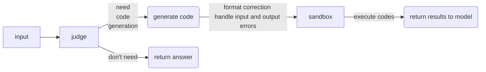
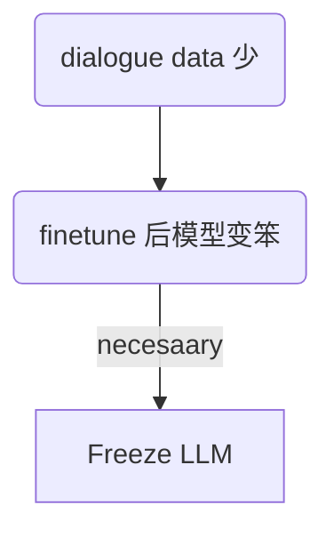
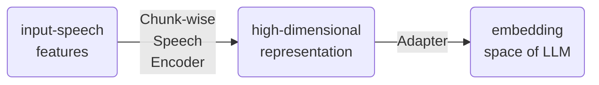
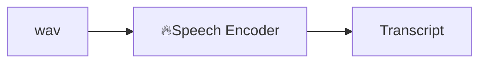
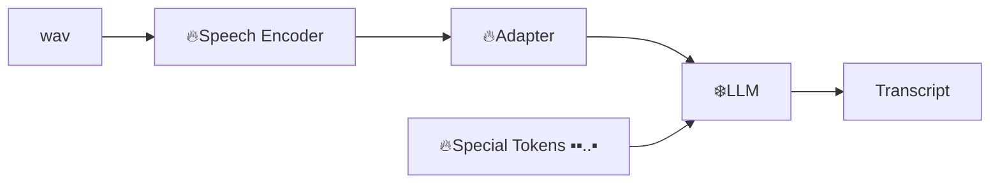
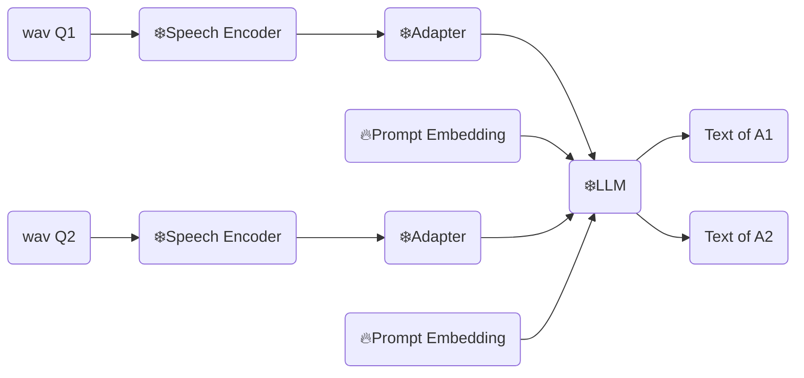
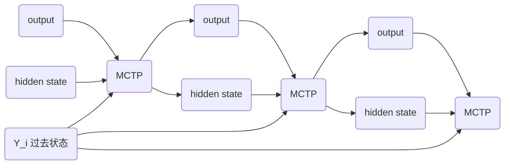

# Prof. Fu Chaoyou's Papers (2024-2025)

His Homepage: https://bradyfu.github.io/

Slide Outline in [Feishu](https://pcnibbp4qon9.feishu.cn/wiki/GuZfwVTk5iMp8qkzoO2czJNanXb)

<div @click="$slidev.nav.next" class="mt-12 py-1" hover:bg="white op-10">
  Press Space for next page <carbon:arrow-right />
</div>

<div class="abs-br m-6 text-xl">
  <button @click="$slidev.nav.openInEditor()" title="Open in Editor" class="slidev-icon-btn">
    <carbon:edit />
  </button>
  <a href="https://github.com/slidevjs/slidev" target="_blank" class="slidev-icon-btn">
    <carbon:logo-github />
  </a>
</div>

---

# MM-RLHF: The Next Step Forward in Multimodal LLM Alignment

## Dataset : MM-RLHF

- Rich & granular
- 人工审查 / 标记

---

# MM-RLHF

## Critique-Based Reward Model


- Reward Model (Trained on MM-RLHF)
- Critique Head : 对 prefer 和 less-prefer ansewr 分别生成批评
  - GPT4o 对 ground truth 添加细节后训练
- Scoring head 根据生成的批评打分
  - 用 ground truth 训练

---

# MM-RLHF

## MM-DPO


- reward model 天然生成 reward margin ($\delta$)

$$\delta = r(y_w)-r(y_l)$$

$r(y_w),r(y_l)$: score of positive and negative samples.

- reward margin 越大 $\beta$ 越大

$$ \beta(\delta)=\beta_{\text{ori}}(1+\omega(1-e^{-k \delta})) $$

---

# Long-VITA: Scaling Large Multi-modal Models to 1 Million Tokens with Leading Short-Context Accuracy

## Train Data

- Comic-9K (Image-Text) (9K个漫画，200K图文对)
- 长视频 (MovieNet Summary)

---

# Long-VITA

## Training

Four Stages:

1. **Vision-Language Alignment**

    -  Freeze LLM & visual encoder , train visual projecter

2. **General Knowledge Learning**

    - Image-text, video, + pure text math & calculation

3. **Long-Sequence Fine-Tuning**

    - 加入更长文本、漫画和视频

4. **Even Longer Sequence Fine-Tuning**

    - 1024K，加入更长的 movie summary data

<!-- 点击时显示的边框 -->
<div v-click="1" v-click-hide="2" class="absolute left-[5%] top-[32%] w-[50%] h-[35%] border-4 border-blue-400 rounded-lg pointer-events-none"></div>

<div v-click="2" class="absolute left-[5%] top-[66%] w-[40%] h-[33%] border-4 border-blue-400 rounded-lg pointer-events-none"></div>

<!-- 点击时显示的右侧说明 -->
<div v-click="1" v-click-hide="2" style="position: absolute; left: 58%; right:5%; top: 30%; border: 3px solid #60a5fa; border-radius: 8px; padding: 1rem; background: rgba(30, 58, 138, 0.2);">

  - pack all training data to a fixed sequence length 
  
  - random sample data from same source, concatenate into one sample , token length = 32K(stage1) / 16K(stage2)

  - Reset positional embeddings & attention masks 
</div>

<div v-click="2" style="position: absolute; left: 58%; right:5%; top: 30%; border: 3px solid #60a5fa; border-radius: 8px; padding: 1rem; background: rgba(30, 58, 138, 0.2);">

  - 同样固定长度
  - 不 reset positional embeddings & attention masks
  - 不使用任何减少参数的方法，例如 LoRA, approximate attention.

</div>

---

# Long-VITA

## Details

- 模型分布在不同 GPU，

- 输入 chunk 以后分布在不同 GPU 计算(对不足 max-tokens 的 input 做 padding)

- Logits-Masked Language Modeling Head
  - 最后一层 $h \cdot W^T$ 只计算最后需要的 next-token ($O(n^2) \rightarrow O(n)$)

---

# MME
**M**ulti**m**odal Evaluation Benchmark

- MME: A Comprehensive Evaluation Benchmark  for Multimodal Large Language Models

- MME-RealWorld: Could Your Multimodal LLM Challenge High-Resolution Real-World Scenarios that are Difficult for Humans?

- Video MME

- etc.

---

# MME

## 着重点：

- 覆盖广, including perception and cognition abilities.

- Avoid data leakage

- Insturciton should be **clear**

- MLLM 的回复应该直观且易于评估

---

# MME


- 同一张图出两道题，groud-truth 分别为 Y N，都对才算对 （防猜）


---

# MME
Data

- Perception
  - Coarse-Grained Recognition. (e.g. count, color, position)
  - Fine-Grained Recognition:  recognizing movie posters, celebrities, scenes, landmarks, and artworks
  - OCR
- Cognition
  - Commensense: basic knowledge in daily life (**zero-shot**)
  - Calculation: 读图中公式（较简单的）
  - 翻译写文本
  - 根据图片生成代码 / debug

---

# MME-RealWorld
Could Your Multimodal LLM Challenge High-Resolution Real-World Scenarios that are Difficult for Humans?

<div class="grid grid-cols-[25%_75%] gap-4">
<div>

MME 难度不够用了

- 全手工
- high res
- contain CN data
- contain reasoning problem
  - 理解全图
  - 看漫画分析人物关系

</div>
<div>


</div>
</div>

---

# Video MME
900 videos

Question-Answer pair 全是完整看完视频后手动编写并审查过的


---

# Aligning and Prompting Everything All at Once for Universal Visual Perception


GLIP / Grounding DINO $\to$ word-region alignment

- need BERT
- 计算量大

---

# Aligning and Prompting Everything All at Once for ...

## Description Prompting at Scale

- **Independent Prompt** 分开 prompt（忽略上下文关系）$\to$ Llama $\to$ prompt embedding

- **Sentence-level Embeddings** 

  word Level embedding $\to$ sentence level

  $\overline{P_{n,d}}=\frac 1 l \sum^{l}_{j=0}P_{n,j,d}$

  实验证明性能不会发生太大变化 极大减少复杂度

---

# Aligning and Prompting Everything All at Once for ...

## Description Prompting at Scale

- **Gated Cross-modality Interaction** 在 GLIP 基础上：

  - 处理单个词汇：传入全 0 向量 $\overline{P_{zero}}$，不融合，只激发模型微调视觉特征($V_{voc}$) 保留语言特征($P_{voc}$)
  - 处理句子：正常融合（注入 $P_{set}$ 到 $V_{set}$.）

- **Region-sentence Alignment**

  - Object Embedings $\hat{O}$: Score $S=\hat{O} \cdot (\bar{P}_{voc}, \hat{P}_{set})$.
  - 为弥补 Sentence-level embedding 的缺陷加入了不相关的 prompt 作为negative

---

# Aligning and Prompting Everything All at Once for ...

## Thing-stuff-equalizing Alignment

- Things : 可以被识别的物体（例如猫狗）
- Stuff : 无法被识别定型的（如天空草地）

将 stuff 当作 things 处理

- Train ：将大块的 stuff mask 切割（connected-component labeling）成小块, 当作 thing 训练
- Inference :  将被识别为相同类别的东西合并：
  $$\hat{M}_{c,h,w} =\sum_{i=1}^q S_{i,c}M_{i,h,w} $$

---

# Aligning and Prompting Everything All at Once for ...

## Single State Train

$$\mathcal{L} = \underbrace{\mathcal{L}_{\text{class}} + \mathcal{L}_{\text{bbox}} + \mathcal{L}_{\text{giou}}}_{\text{encoder and decoder}} + \underbrace{\mathcal{L}_{\text{mask}} + \mathcal{L}_{\text{dice}}}_{\text{last layer of decoder}}$$

**Train multi-data at once :**

I : an image,

T : a phrase that describes an instance in $I$

B : the corresponding bounding box.


Vallina: $\{I,T,B\}$

Now: $\{I,(T_1,B_1),(T_2,B_2),...,(T_n,B_n)\}$

---

# Thyme: Think Beyond Images

## Pipeline




---

# Thyme

## Sandbox

- **security and robustness** : 
  - Skan dangerous operations: `remove, unlink, move, rename`
  - Maximum execution time 10s
- **reduce code generation burden**
  - `autopep8` formatting, indentation alignment.
  - `ast`, fix bbox boundries
  - preset local variables, e.g. `image_path`
  - Multicode segments:
    - record all variables throughout the model’s code execution process and incorporate historical context in multi-round sandbox invocations.

---

# Thyme

## Train Data

- 无需操作即可回答
- 需要进行图像操作的
- 需要多轮 reasoning 和图像操作的

- 图像操作
  - Cropping (high res，问题所需占比不超过5%), rotation (30-335) , low contrast, computational reasoning(math centric)(让code不只用来处理图片)
  
  - **Multi-round conversational datasets** (Further enhancement & Error correction)

---

# Thyme

## Train Data

construct:


example:


---
transition: fade-out
---

# Thyme

## Training

Each training sample:

$X=\{(I,Q);([T_0,C_0,S_0],...,[T_t,a])\}$

Image I, Question Q, thinking process T, optional Code C and Result S, final answer a.

## Issue

1. Two rounds dialogue 会训练出故意在第一轮做错，第二轮纠正的模型

2. Math Data 少，模型几乎没有提升

---

# Thyme

## Issue

1. Two rounds dialogue 会训练出故意在第一轮做错，第二轮纠正的模型

2. Math Data 少，模型几乎没有提升

## Solve

1. 多轮对话: mask 中间所有轮
2. mask $S_{i=1...t}$，防止偷学程序结果
3. Math data: 其他数据训练完后用于微调，低 lr，不 mask 

---

# Thyme RL
auto GRPO

GRPO, but 

1.
$$
\text{temperature} = \begin{cases}

0.0 \quad \text{generating } \textbf{code} \\
1.0 \quad \text{generating } \textbf{text}

\end{cases}

$$

否则因为 code 比较难，模型会逐渐拒绝生成 code

2. Sample 的时候设置长度上限

3. 如果同一短语重复多次 (> 50% outputlength) 提前结束

---

# Freeze-Omni: A Smart and Low Latency Speech-to-speech Dialogue Model with Frozen LLM



---

# Freeze-Omni

<div class="grid grid-cols-[55%_45%] gap-1">

  <div>
    
  </div>

  <div>



  - Speech Encoder : several down-sampling convolutional layers.+ several Transformer

  - Adapter: only several down-sampling convolutional layers

  - Down-sampling: 降低帧率 增加LLM速度来减少延迟
  
  </div>

</div>

---

# Training
Freeze-Omni

**Speech-Encoder**

(a)


(b)


---

# Training **Speech-Encoder**
( c )



---

# Training

**Speech Decoder**

<div class="grid grid-cols-[60%_40%] gap-1">

<div>
  
</div>

<div>
(a) single-codebook based codec model using only speech data

(b) NAR 和 AR 用相同的参数

\(c) LLM 生成 token 的风格和数据中的风格不同，第三阶段用于将 decoder 和 llm 更好的对齐
</div>

</div>

---

# R1-Reward: Training Multimodal Reward Model Through Stable Reinforcement Learning 

将 RL 引入 Reward Models

**PPO / reinforce++ 在 reward model training 中的劣势**

- $\pi_\theta$ 和 $\pi_{\theta_{old}}$ 相差过大时 exp 会爆，advantage < 0 的时候会导致loss不稳定
- 因为输出只有 2 选项，容易被学会。此时可能出现例如255个1和1个0，normalize后的advantage会相当大影响稳定性

---

# R1-Reward

## Pre-Clip
`exp`之前就 clip

**PPO**

$$
\text{clip}(\frac{\pi_\theta(a_t | s_t)}{\pi_{\theta_{old}}(a_t|s_t)},1- \epsilon, 1+\epsilon)
$$

```python
ratio = (log_probs - old_log_probs).exp() 
```

**THIS**

```python
log_diff = log_probs - old_log_probs
clip(log_diff, epsilon, -epsilon)
ratio=log_diff.exp()
```

---

# R1-Reward

## Advantage Filter

移除掉偏离超过 $3\sigma$ 的值

$$
A_{\text{std}}=\frac{A-\mu_A}{\sigma_A+\epsilon}
$$

$$
\hat{A}=
\begin{cases}
A_{\text{std}} \quad \text{if } |A_{\text{std}}| \le 3 \\
0 \quad \text{else}
\end{cases}
$$

---

# R1-Reward

## Reward

$$
\text{reward} = \text{result reward} \times (1+0.5 \times \textbf{Consistency Reward})+0.5 \times \text{formatting reward}
$$

**format**: 限制为 `<think>..</think><answer></answer>`

**Consistency**: 

模型有时给出 `<think>...response 2 is better</think><answer>1</answer>`

- result reward 只和答案有关
- reward: 使用 Qwen2.5-VL-7B-Instruct 检查 think 和 answer 是否一致

---

# Zooming from Context to Cue: Hierarchical Preference Optimization for Multi-Image MLLMs 
 \ 

尝试解决 MLLM 在多图片下性能降低的问题 $\to$ cross modal alignment 做得不好

- 使用实验证明了根本瓶颈是 **上下文描述能力缺陷**
  1. 内部图像理解能力不足
  2. 实验：
    - baseline 直接回答
    - 对每个图像生成准确描述后回答 
    - 对每个图像生成随机(bad)描述后回答。 
    
    Baseline 随长度增加掉很快，几乎与 bad 一样

---

# Zooming from Context to Cue: Hierarchical ...

## CcDPO


- Context-Level Optimization
  - Ensuring comprehensive integration of all relevant visual information across image sequences
- Needle-Level Optimization

---

# CcDPO

## Context-Level Optimization

$y_w=$`[For Image 1:<caption 1>, For Image 2:<caption 2>,..., For Image n:<caption n>]`

$y_l$:

**Sequence Truncation** (simulates context omission) 移除部分或全部
  - `[For Image 1:<caption 1>,..., For Image n:<caption n>]`
  - `[For Image 1:<short caption 1>, For Image 2:<short caption 2>,..., For Image n:<short caption n>]`

**Content Swapping** (simulates conflation)
`[For Image 1:<caption 2>, For Image 2:<caption 1>, ...]`

$$
\mathcal{L}_{\text{DPO}_t} = 
- \log \sigma \left(
    \beta \log \frac{\pi_\theta(y_w \mid v_w, x)}{\pi_{\text{ref}}(y_w \mid v_w, x)}
    - \beta \log \frac{\pi_\theta(y_l \mid v_w, x)}{\pi_{\text{ref}}(y_l \mid v_w, x)}
\right),
\quad
y_l \in \{ y_l^{\text{trunc}},\, y_l^{\text{short}},\, y_l^{\text{swap}} \}
$$

---

# CcDPO

## Needle-Level DPO

Target region $r$, yielding $v_r$. $r'$ not overlapping with $r$

$y_r=$ `[For the marked area of Image 1: <caption r_1>, ...]`

$y_l=$ `[For the marked area of Image 1: <caption r_1'>, ...]`

<div v-click="1">
rewarding focus on relevant details and penalizing attention to misleading content
</div>

---

# CcDPO

## Needle-Level DPO

**rewarding focus on relevant details and penalizing attention to misleading content**

1) _Focusing on Relevant Visuals_: rewards details, countering neglect visual content
$$
\mathcal{L}_{\text{Focus}}(v_w, y_w) = 
- \log \sigma \left(
    \beta_1 \log \frac{\pi_\theta(y_w \mid v_w, x)}{\pi_{\text{ref}}(y_w \mid v_w, x)}
    - \beta_1 \log \frac{\pi_\theta(y_w \mid x)}{\pi_{\text{ref}}(y_w \mid x)}
\right)
$$
2) _Rejecting Contradictory Visuals_: penalizes assigning high probability to $y_w$ when using contradictory image $x_l$
$$
\mathcal{L}_{\text{Reject}}(v_l, y_w) = 
- \log \sigma \left(
    \beta_2 \log \frac{\pi_\theta(y_w \mid x)}{\pi_{\text{ref}}(y_w \mid x)}
    - \beta_2 \log \frac{\pi_\theta(y_w \mid v_l, x)}{\pi_{\text{ref}}(y_w \mid v_l, x)}
\right)
$$
Combined DPO loss:  
$$
\mathcal{L}_{\text{DPO}_v}(v_w, y_w, v_l)
= \mathcal{L}_{\text{Focus}}(v_w, y_w)
+ \mathcal{L}_{\text{Reject}}(v_l, y_w)
$$

---

# Cantor : Inspiring Multimodal Chain-of-Thought of MLLM
融合视觉上下文获取与逻辑推理


使用一个单一 MLLM 配合很多个 prompt 作为每一个模块

---

# Woodpecker: Hallucination Correction for Multimodal Large Language Models (2023)


<div class="grid grid-cols-[50%_50%] gap-4">

<div>

**_Key Concept Extraction + Question Formulation_**:
Prompt LLM 

**_Visual Knowledge Validation_**:

- Object level question :  openset object detector
- Attribute level question: a pre-trained VQA model
</div>
<div>

**_Visual Claim generation_**:
a QA-toClaim model

**_Hallucination Correction_**:
Prompt LLM
</div>

</div>

---

# VITA-Audio
Fast interleaved Cross-Modal Token Generation for Efficient Large Speech-Language Model

1. Audio - text 的 attention 高度相关。实验：只要给了 h，即使 mask 其他 token 也能正常生成该 token 的 audio


Forward Pass: 交替生成文本/语音 token

---

# VITA-Audio

## MCTP

$$
p_{t+i}(Y_{t-1},\dots,Y_0)=\tilde{P}[Y_{t+i}|Y_{t-1},\dots,Y_0,h_{t+i-1},o_{t+i-1},\dots,o_t]
$$

- 用 Transformer 根据 $Y, h, o$ 预测下一 $h, o$

- 10 个 MTCP : 从单个 token $\to$ 10 个 audio-token



---

# VITA-Audio : Train

Pipeline


---

# VITA-Audio

## Inference modes


## Related 

**Qwen-2.5 Omni**: $\quad$ Thinker-Talker:

Talker 获得 thinker 的所有历史，以及当前的 hidden state 来预测下一个 audio。
