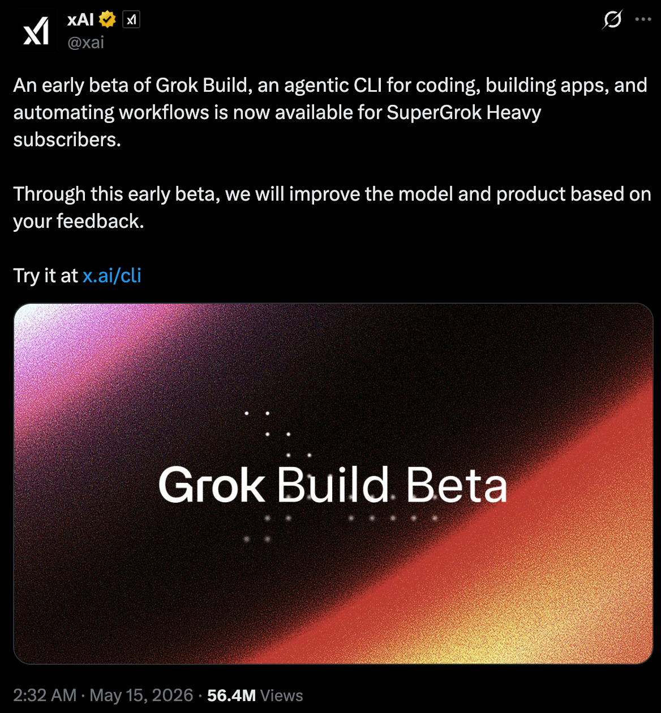
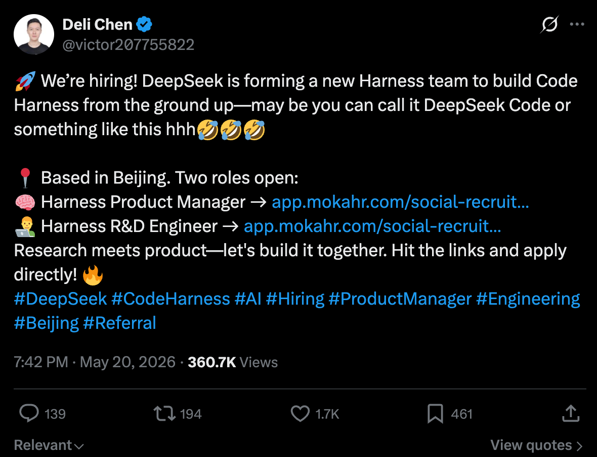
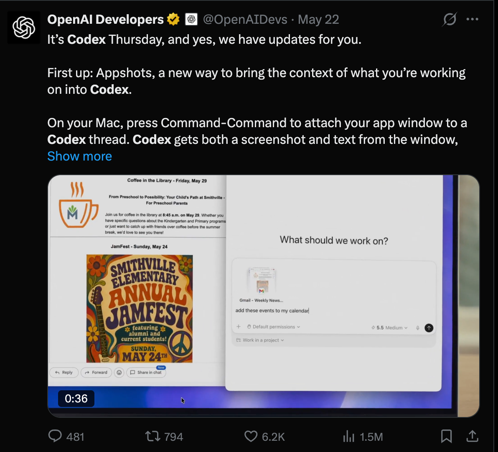
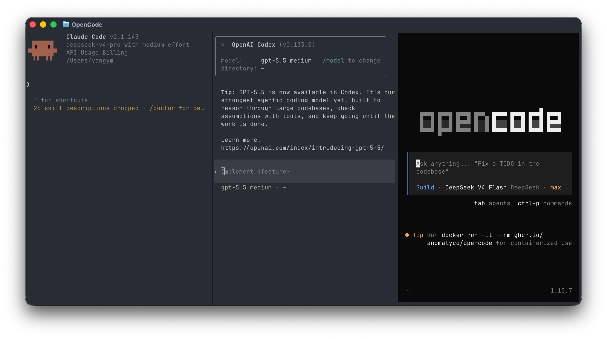
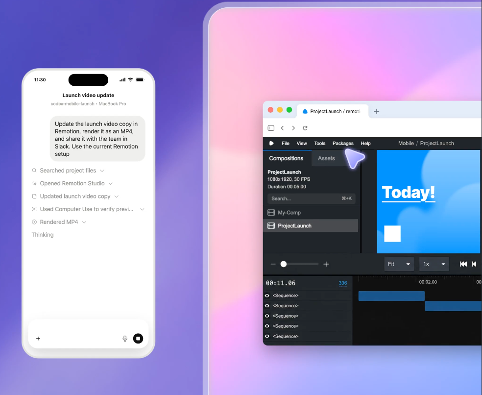
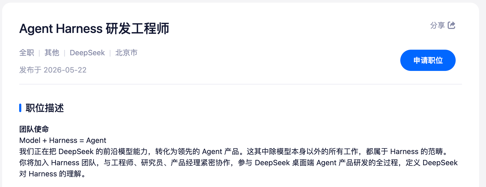

课前小讲

# 从模型到 Agent

不同 Harness 塑造的不同 Agent

Model + Harness = Agent

<!--
大家好，我的课前小讲主题是：不同的 Harness 如何在同一模型上塑造出不同 Agent
-->

---
transition: fade-out
---

# 大家都在做 Coding Agent

  <figure class="launch-card launch-card-tall">
    
    <figcaption>Grok Build Beta</figcaption>
  </figure>
  <figure class="launch-card">
    
    <figcaption>DeepSeek Code</figcaption>
  </figure>
  <figure class="launch-card">
    
    <figcaption>Codex 更新</figcaption>
  </figure>

grok build:<a>https://x.com/xai/status/2054993285152989373</a>; Deepseek Code: <a>https://x.com/victor207755822/status/2057064415300841626</a>

<!--
最近几乎每个大厂都在招募自己的人马，做自己的 coding agent。
如果模型才是核心，为什么大家还要花这么多成本，去做自己的 Coding Agent 系统？
codex 和 claude 两个早已入场的选手就不说了，像 grok 和 deepseek 明明有 opencode 之类的开源选择，依旧要选择自己去构建 harness 系统，去更适配自己的模型。
基础设施的 harness 的作用真的能这么大？有个 agent loop 难道不就够了吗？
-->

---

# 什么是 Harness

Harness 是把模型放进开发环境的一整套运行框架。

  
<b>Context</b>看见什么历史，怎么保留、压缩、删除

  
<b>Tools</b>文件、终端、浏览器、搜索如何接入

  
<b>Control</b>什么时候规划、执行、暂停、恢复

  
<b>Safety</b>权限、沙箱、审批、写入边界

<a href="https://www.anthropic.com/engineering/harness-design-long-running-apps">anthropic.com/engineering/harness-design-long-running-apps</a>; <a>https://zhuanlan.zhihu.com/p/2014014859164026634</a>

<!--
harness 就是模型外面的工作系统。
主要包括模型的上下文管理，权限管理和工具管理，错误处理等。
另外，在项目中编写，并让Agent工作中不断主动完善的文件也是harness的一部分，但是我们这次不讨论那部分，而是讨论那些被写入Agent工具源码的harness。

我们会分析三个主流Agent的harness设计，和相应的工作风格。
-->

---

# 三种设计风格

  

    

      <h2>Claude Code</h2>
      
长任务连续性优先：尽量让 agent 在复杂上下文里不断线。

    

    

      <h2>Codex</h2>
      
安全边界和工作流优先：从 CLI 走向可长期使用的任务工作台。

    

    

      <h2>OpenCode</h2>
      
开放通用优先：跨 provider 的 harness，强调可替换和可迁移。

    

  

  <figure class="wide-shot">
    
  </figure>

<!--
这里是三个目前最流行的coding agent 框架

Claude Code 优先保证长任务的连续性，有着复杂和优秀的的记忆管理。并且用 ablation study 确认每个设计的引入是必要的。
Codex 优先把安全边界和产品化工作流和设计做好，推向大部分用户。
OpenCode 优先做到开放、通用、和 TUI 的稳定性。
-->

---

# Claude Code
Context: 把历史变成任务状态

按顺序执行：

  
1<b>HISTORY_SNIP</b><em>删掉明显没用的历史片段，如久远工具调用</em>

  
2<b>Microcompact</b><em>在缓存层面做细粒度编辑</em>

  
3<b>CONTEXT_COLLAPSE</b><em>把旧轮次归档成带结构的摘要</em>

  
4<b>Autocompact</b><em>最后兜底：整体压缩</em>

<a href="https://zhuanlan.zhihu.com/p/2022389695955346888">zhuanlan.zhihu.com/p/2022389695955346888</a>

<!--
Claude Code。
把上下文当作任务状态来管理。

描述一下

Claude Code 的设计思路就是：为了保住长程连续性和模型的性能，harness 复杂没关系。事实上claude code是所有这些编码工具里最复杂的，泄露版本有超过五十万条代码。
-->

---

# Codex
安全边界和工作流

  

    
CLI -> Codex App

    <h2>Codex CLI</h2>
    <ul>
      <li>上下文到达限度后自动 compact</li>
      <li>Prompt 主要针对 GPT 系列模型优化</li>
      <li>Rust 开发，系统层面 sandbox</li>
    </ul>
    <h2>Codex App</h2>
    <ol>
      <li>worktree 多任务后台执行</li>
      <li>远程连接其他设备</li>
      <li>日常模式包装复杂功能</li>
      <li><code>/goal</code> 到达目标前持续工作</li>
    </ol>
  

  <figure class="app-shot">
    
  </figure>

<a href="https://github.com/openai/codex">github.com/openai/codex</a>；<a href="https://openai.com/codex/">openai.com/codex</a>

<!--
Codex 则是围绕 GPT 模型，打造一个安全、能长期用的工作环境。

Codex 在上下文方面没有做什么处理。
但有着系统层面的非常严谨 Sandbox，这种权限模式令 codex 失去了如 claude code 的方便的权限自定义能力，但也基本没有 edgecases。codex 同样使用了 rust 而不是 typescript, GPT 系列模型也以极其严谨和完备的边界处理为名, 这大概是 openai 的设计哲学。

与此同时，Codex App 在用户端做了不少 feature, 例如多worktree的好看UI，远程连接其他设备开发，宠物功能,computer use，goal等，抢占日常用户。
-->

---

# OpenCode
通用 Provider 的 Harness

prompt:

Provider 特定提示 + 通用模板

context 管理:

  

    <b>Prune</b>
    只在能释放足够 token 时使用；保留最近上下文和重要 skill 输出。
  

  

    <b>Compact</b>
    压缩旧历史，但保证最后两轮消息完整。
  

<a href="https://opencode.ai/docs/">opencode.ai/docs</a>；<a href="https://github.com/opencode-ai/opencode">github.com/opencode-ai/opencode</a>

<!--
OpenCode 作为一个独立的开源项目，走了第三条路：尽量做通用 harness，而不深绑某一家模型。

它的提示词结构是 provider 特定提示加通用模板。
不同模型有各自的适配，但整体框架保持统一。

与此同时它的 TUI 是所有 agent 里面最鲁棒的，不会出现奇奇怪怪的错位；但他的缓存命中率和一些工具调用bug也是最差的，这能是开源项目的一大特点，为了吸引用户而在外观上下了更大的功夫。
-->

---

# Harness 的几个取舍

| 维度 | Claude Code | Codex | OpenCode |
| --- | --- | --- | --- |
| 模型适配 | 深度绑定 Claude | 深度绑定 GPT | 跨 provider |
| 上下文策略 | 多层记忆 / 归档 | 简洁 compact | prune + compact |
| 安全边界 | 工具与权限控制 | 强系统沙箱 | 依赖部署配置 |
| 产品方向 | CLI 长程任务 | CLI + App 工作台 | 开源通用 agent |
| 主要优势 | 长任务连续性 | 安全和产品体验 | 开放和可迁移 |
| 主要代价 | 复杂、绑定强 | 跨模型弱 | 极致适配较难 |

<!--
上下文管理越细，长任务越稳，但系统越复杂。
安全边界越硬，可控性越强，但有些操作会受限。
越通用，模型越容易换，但深度适配就越难。

这也解释了为什么不同 agent 做同一个任务，过程和结果会不同。
-->

---

<RemoteBenchmark />

<a href="https://blog.can.ac/2026/02/12/the-harness-problem/">blog.can.ac</a>; <a href="https://www.tbench.ai/leaderboard/terminal-bench/2.0">tbench.ai/leaderboard/terminal-bench/2.0</a>

<!--
这一页是我调研了一些相关文献找到的对比结果。

可以看到

但至少能说明一点：同一个模型放进不同 harness，表现确实会变。
benchmark 测的不只是模型，还包括上下文管理、工具调用、任务循环这些外层设计。
-->

---

# 实验测试

    创建一个完整的 2D 流体模拟器，使用 SPH（Smoothed Particle Hydrodynamics）算法。

    要求：
    1. 使用 HTML5 Canvas 2D 渲染，纯 vanilla JavaScript，零依赖
    2. 实现 dam break、压力力、粘度力、重力、边界碰撞
    3. 支持鼠标扰动、空格重置、粒子数/粘度/重力调节
    4. 显示 FPS 和粒子数
    5. 单 HTML 文件，浏览器直接打开，稳定 60FPS 运行至少 500 个粒子

模型：DeepSeek V4 Pro  
环境：DeepSeek 网页端专家模式 / Claude Code (max) / OpenCode (max)

<!--
我自己也做了：同一个模型、同一个 prompt，让不同环境生成一个 SPH 流体模拟器。

这个任务够具体，能直接打开看效果。
但也有局限：本质上还是一次性生成单个 HTML demo。

所以先别把它当成严谨 benchmark，更像一个观察样本：看不同 harness 面对同一任务时，花多少时间、多少 token，生成什么样的第一版产物。
-->

---

# 实际测试

  <DemoCard src="./public/compare/deepseek-web.png" demo="/compare/deepseek-web-demo.html" label="DeepSeek 网页端" />
  <DemoCard src="./public/compare/claude-code.png" demo="/compare/claude-code-demo.html" label="Claude Code" />
  <DemoCard src="./public/compare/opencode.png" demo="/compare/opencode-demo.html" label="OpenCode" />

| Harness | 用时 | Token |
| --- | ---: | ---: |
| DeepSeek 网页端 | 202s | - |
| Claude Code | 10m52s | 57.4k |
| OpenCode | 27m25s | 101.5k |

<!--
结果不用看得太重：网页端最快，因为它更像一次性生成。
Claude Code 和 OpenCode 会走更完整的 agent 流程，时间和 token 成本自然更高。

这里真正想说明的是：同样的模型、同样的任务，放进不同 harness，执行路径已经不一样了。
但这个实验只测到了"第一版长什么样"。
要看 harness 的核心能力，还得看项目继续演化时会发生什么。
-->

---

# 实际测试 - 2

同样做 SPH，但这次要求完整 Vite / React 工程、WASM 加速（可选）、可交互控制面板。(一次额外 Debug 轮次）

  <DemoCard src="./public/second-compare/pi.png" demo="/second-compare/pi/" label="Pi" />
  <DemoCard src="./public/second-compare/claude.png" demo="/second-compare/claude/" label="Claude Code" />
  <DemoCard src="./public/second-compare/opencode.png" demo="/second-compare/opencode/" label="OpenCode" />

| Harness | WASM | 用时 | Token |
| --- | ---: |---: | ---: |
| Pi（无配置） |$\checkmark$| – | 79k |
| Claude Code |$\checkmark$| 11m59s | — |
| OpenCode |$\times$| 11m38s | 90.8k |

<!--
然后我又换了一个更像真实工程的版本。
这次不是单 HTML，而是要求它们交付完整的 Vite / React 项目，并且引入 WASM 加速、组件化控制面板和更复杂的交互。

这页可以直接点进去玩。
相比上一页，这里更能看到 harness 在项目组织、构建产物、资源路径、可运行性这些工程细节上的差异。
-->

---

# 

  

  Model + Harness = Agent
  

  <figure class="closing-shot">
    
  </figure>

<a>https://app.mokahr.com/social-recruitment/high-flyer/140576#/job/ec402ff5-47fe-4e32-820c-b04884fca585</a>

<!--
最后，Deepseek 在他们的招募页上写下:
Model + Harness = Agent

模型决定了能力的上限——能不能理解代码、生成代码、推理问题。
但 harness 决定这些能力怎么落到真实项目，模型怎么解锁他的能力推进任务。不同的 harness 塑造不同的 agent，不同的风格，已经到了和 model 同等的重要程度
-->
